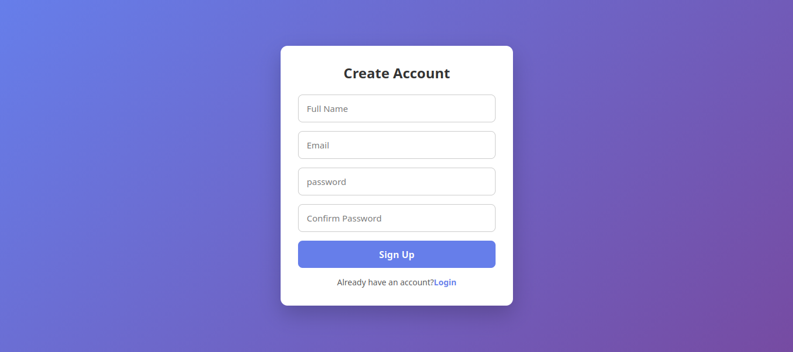

# 🔐 Login & Signup UI

A clean and responsive **Login and Signup User Interface** built using **HTML, CSS, and JavaScript**.  
This project focuses on frontend form design, validation, and smooth user experience.

---

## 🚀 Features
- 🔑 Login and Signup forms
- 👁️ Show / hide password functionality
- ✅ Basic form validation
- 🎨 Clean and modern UI design
- 📱 Fully responsive layout
- ⚡ Lightweight and fast

---

## 🛠️ Technologies Used
- HTML5  
- CSS3  
- JavaScript  
- Git & GitHub  

---

## 📂 Project Structure
```

├── index.html
├── login.html
├── signup.html
├── style.css
├── script.js
├── README.md

````

---

## ⚙️ How to Run the Project

1️⃣ Clone the repository:
```bash
git clone https://github.com/harika655/Login-SignUp-UI.git
````

2️⃣ Open the project folder:

```bash
cd Login-SignUp-UI
```

3️⃣ Run the project:

* Open `index.html` in your browser
  **OR**
* Use Live Server extension

---

## 🌐 Live Demo

👉 [https://harika655.github.io/Login-SignUp-UI/](https://harika655.github.io/Login-SignUp-UI/)

---

## 📸 Screenshots

### 🔐 Login Page


### 📝 Signup Page


### Result page


---

## 👩‍💻 Author

**Harika T**
Frontend Developer

* GitHub: [https://github.com/harika655](https://github.com/harika655)
* LinkedIn: (www.linkedin.com/in/harika-t-b1731b222)

---

## 📄 License

This project is created for **learning and portfolio purposes**.

````
